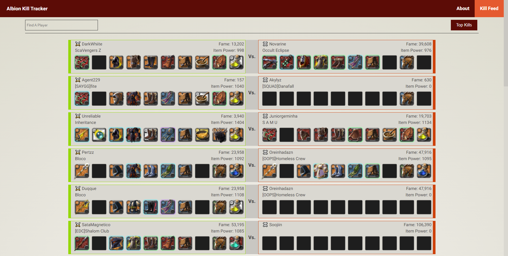

# The Albion Kill Tracker

Albion Kill Tracker is a 3rd party tool used to track your friends kills or just track the recent and top kills from the communuity of albion!

#### Technologies

Vue Js
API: https://www.amiiboapi.com/

#### Features

- Fetch more recent kills
- Fetch top kills based on fame
- Fetch specific players

#### Planned Features

- Guild and Alliance Tracking
- Death Tracking
- Ability to view inventory
- Check participants in kill
- Track damage dealt.
- Track assists
